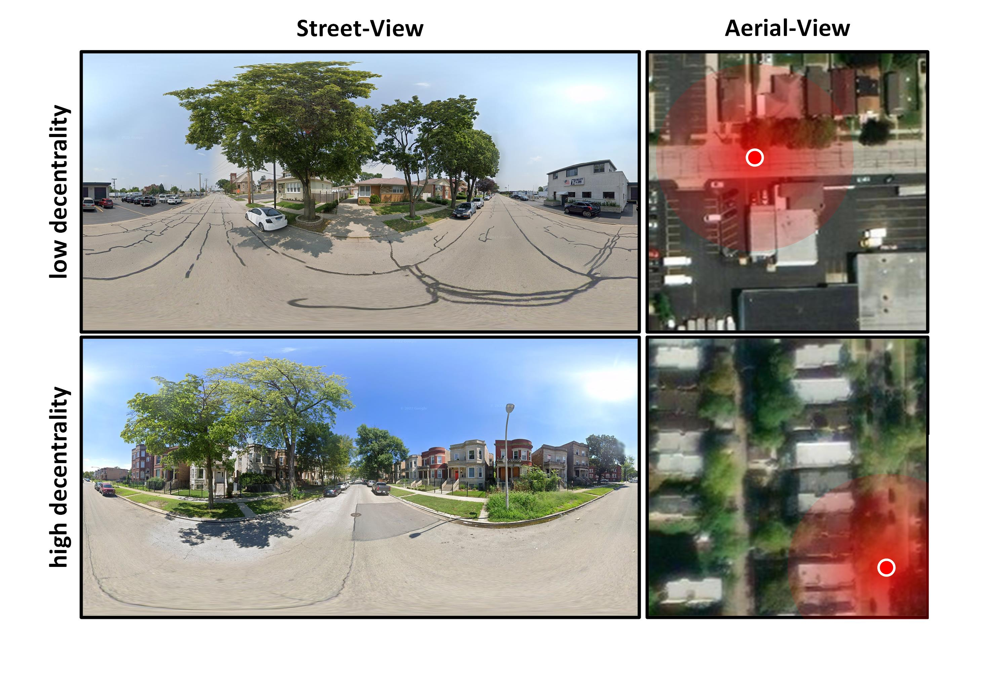
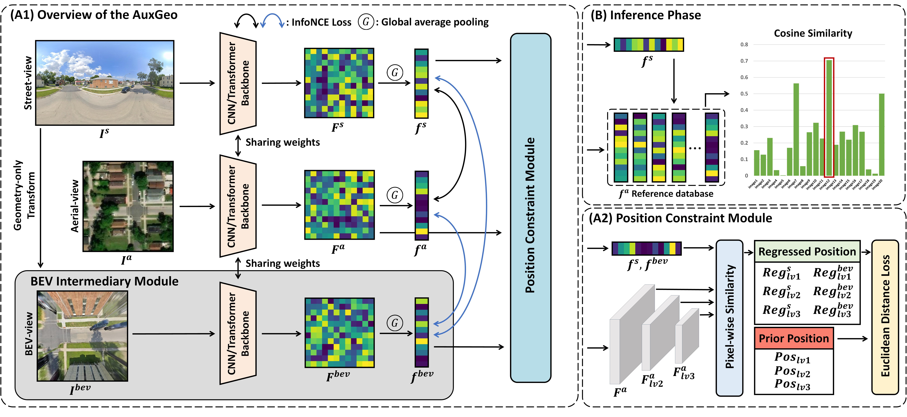

# Cross-View Geo-Localization with Panoramic Street-View and VHR Satellite Imagery in Decentrality Settings
[](https://arxiv.org/abs/2412.11529)

This work has been accepted by ISPRS Journal [https://www.sciencedirect.com/science/article/pii/S0924271625001753].


## ✅ To-Do

- [x] Initial repo structure
- [x] Training scripts
- [x] DReSS Dataset
- [ ] Tools for building your own dataset


## 1. Decentrality description

The cross-view geo-localization (CVGL) task aims to retrieve the best-matched satellite reference image from a database for each query street-view image. Traditionally, datasets such as CVUSA and CVACT adopt a center-aligned organization, ensuring that each query is precisely centered within its corresponding paired reference image. However, this idealized setting does not reflect real-world applications, where reference images are typically pre-collected **without explicit alignment** to queries.

To construct a more practical reference database, seamless tiling methods (e.g., VIGOR) are employed. However, this inevitably introduces **positional offsets**, which we define as **decentrality**, where queries are not always located at the center of their best-matched reference images. As decentrality increases, queries tend to be positioned toward the edges, making feature extraction and matching more challenging. Since there is no established industry standard for constructing seamless reference databases over an area of interest (AOI). 



## 2. DReSS: Decentrality Related Street-view and Satellite-view dataset
DReSS dataset covers over 400 \(km^2\) in each of eight diverse cities around the world. The dataset consists of 422,760 aerial images sourced from Esri World Imagery, captured at zoom level 18 with a ground resolution of approximately 0.597 \(m\). Each aerial image has a resolution of (224 × 224) pixels. Additionally, DReSS features 174,934 street-view panoramas obtained using the Google Street View. These panoramas are randomly distributed within the coverage area of the aerial images, with an average interval of about 500 \(m\) between samples. The panoramas are North-aligned, and each has a resolution of (2048 × 1024) pixels. 


### 2.1 City distribution


### 2.2 Dataset Download
To download the [DReSS dataset](https://pan.baidu.com/s/1m3VLsyX3mIl1DmK_X6v4Lw?pwd=MAgs ), you can follow the instructions below:

#### Street-View Image download

To comply with Google Street View's policies, we only provide the **panorama IDs** along with instructions for downloading. This allows users to access the dataset independently.

With these IDs, users can retrieve the panoramas using the [Google Street View Static API](https://developers.google.com/maps/documentation/streetview?hl=zh-cn) or [third-party tools](https://svd360.com/).

#### Aerial-View Image download
To comply with Esri's policies, we only provide the **coordinates and zoom level** along with instructions for downloading. This allows users to access the dataset independently.

With these coordinates and zoom level, users can retrieve the aerial-view reference images using the [Esri API](https://github.com/andolg/satellite-imagery-downloader).

**If you have any questions or encounter any issues during access or download, feel free to contact us** at [xiapanwang@whu.edu.cn], we will help you downloading the DReSS as soon as possible.


## 3. Framework: AuxGeo



### Train the AuxGeo model
```python
# -- eg. VIGOR dataset

#-- 1. build the distance map.
python calc_distance_vigor.py

# -- 2. train the auxgeo model on vigor.
python train_vigor.py

# -- 3. evaluate the auxgeo model on vigor.
python eval_vigor_same.py
python eval_vigor_cross.py


# -- eg. DReSS dataset

#-- 1. build the distance map.
python calc_distance_skymap.py

# -- 2. train the auxgeo model on vigor.
python train_skymap.py

# -- 3. evaluate the auxgeo model on vigor.
python eval_skymap_same.py
python eval_skymap_cross.py

```


## Acknowledgments

This code is based on the amazing work of: [Sample4Geo](https://github.com/Skyy93/Sample4Geo) and [HC-Net](https://github.com/xlwangDev/HC-Net). We appreciate the previous open-source works.
## Citation✅
```
  @article{xia2025cross,
  title={Cross-view geo-localization with panoramic street-view and VHR satellite imagery in decentrality settings},
  author={Xia, Panwang and Yu, Lei and Wan, Yi and Wu, Qiong and Chen, Peiqi and Zhong, Liheng and Yao, Yongxiang and Wei, Dong and Liu, Xinyi and Ru, Lixiang and others},
  journal={ISPRS Journal of Photogrammetry and Remote Sensing},
  volume={227},
  pages={1--11},
  year={2025},
  publisher={Elsevier}
}
```

